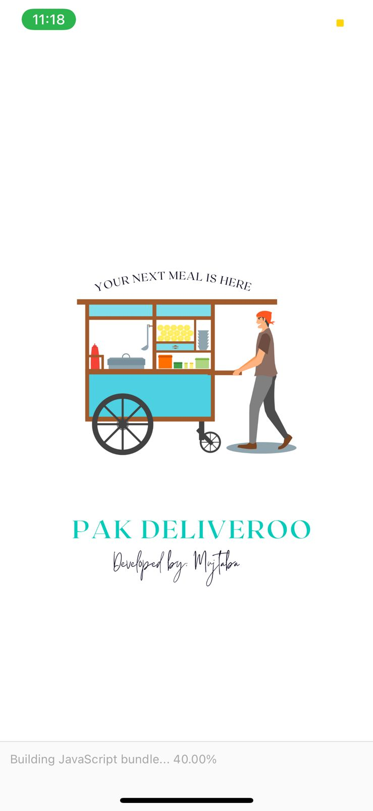
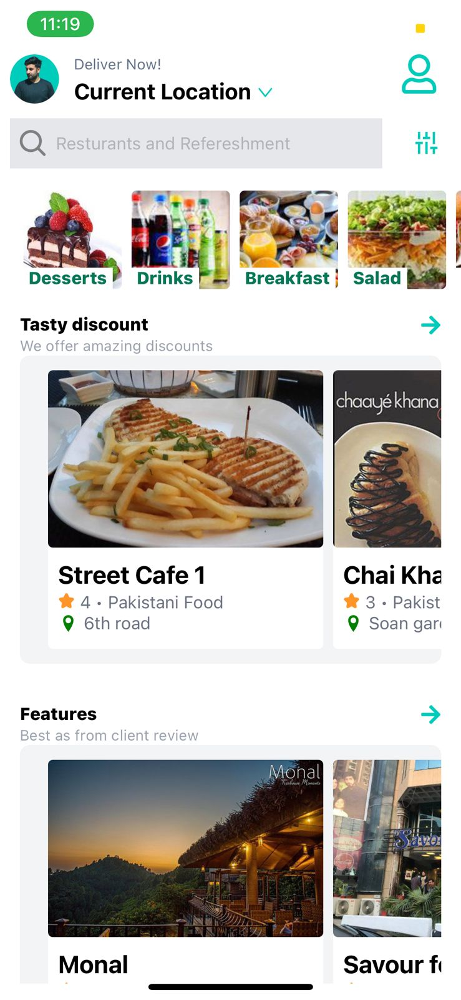
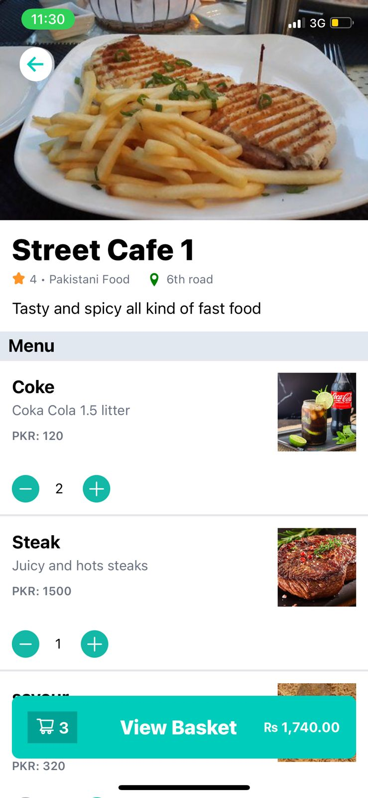
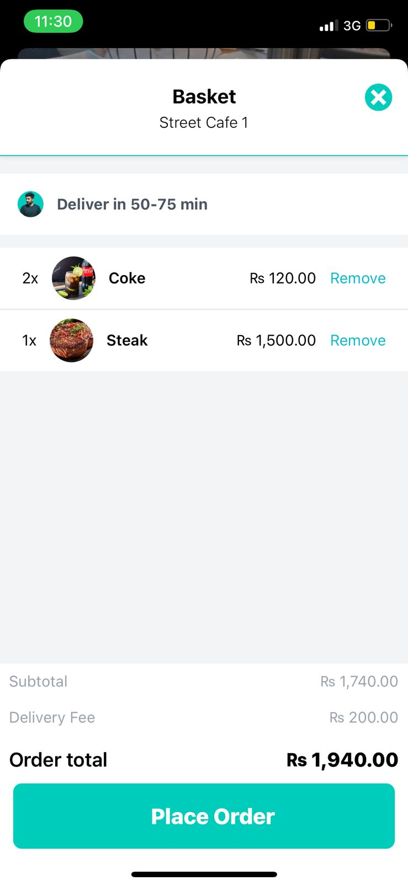
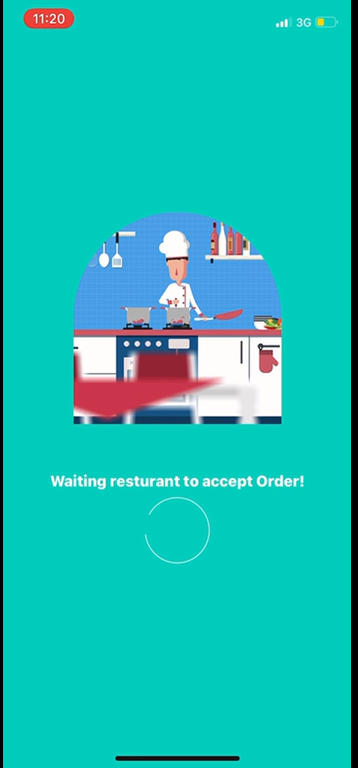
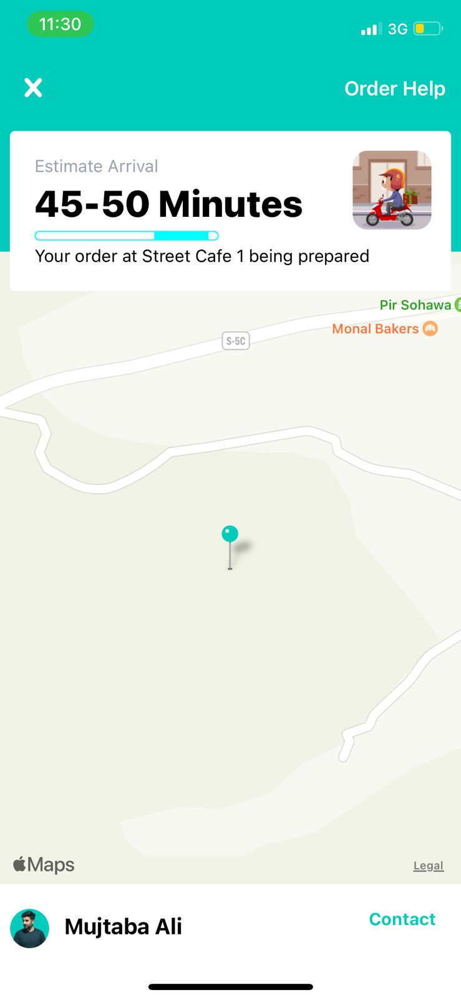

Pak deliveroo is cross-platform(Android & IOS) Mobile application which is created in React Native.
Other things that are in used
- React
- Sanity
- Redux
- Tailwindcss

## Video demo: https://vimeo.com/756063945
## Android and IOS builds:https://drive.google.com/drive/folders/1MzhluP1JRPOp7wbaUQEBrijiQQMIem0g?usp=sharing








First, run the development server:

```bash
expo start
